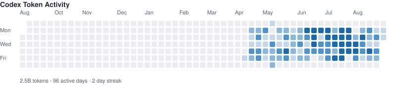

# Hi, I'm MichikatsuOwO | Wong Anne 👋

I'm a software engineer focused on **B2B commerce systems**, **backend platforms**, and **AI-powered internal tools**.

Currently, I work on real-world B2B and cross-border commerce scenarios, including product data, seller validation, order workflows, compliance checks, and operational automation.

I'm especially interested in building tools that turn messy business workflows into reliable, automated systems.

## What I'm working on

* Building AI-assisted tools for B2B operations
* Learning and practicing full-stack development with TypeScript
* Exploring AI Agent, tool calling, RAG, and workflow automation
* Turning real business pain points into practical software products
* ⚽ Building AI-powered football analytics tools
* Preparing for remote-friendly engineering opportunities

## Current focus

```txt
Backend Engineering  -> Java / Spring Boot / MyBatis / MySQL / Redis / MQ
Full-stack           -> TypeScript / React / Next.js / Hono / Nest.js
AI Engineering       -> AI Agent / RAG / Tool Calling / Workflow Automation
Business Domain      -> B2B / Cross-border Commerce / 3PL / Operations Tools
```

## Professional Experience
I currently work as a software engineer at GigaCloud, focusing on backend engineering for B2B commerce platform systems.

My work involves building and maintaining backend services that support cross-border business workflows, product and seller operations, data validation, and internal operational tools.

My daily work includes:

Building backend APIs for internal B2B platform systems
Implementing business validation rules and operational workflows
Supporting product, seller, and cross-border commerce scenarios
Handling batch data processing and import/export features
Working with relational databases and SQL optimization
Collaborating with product, QA, and business teams to deliver reliable features

Tech stack:

Java / Spring Boot / MyBatis-Plus
MySQL / OceanBase / Redis / RabbitMQ / XXL-JOB
Git / CI workflows

This experience helps me understand how real B2B platforms operate, and it inspires me to build AI-powered tools for business workflow automation, data validation, and operational efficiency.

## Why I build

I believe software engineers should not only write code, but also understand business problems deeply.

My long-term goal is to become a **full-stack product engineer** who can independently discover pain points, design systems, build products, and deliver real business value.

I care about:

* Practical engineering
* Clean system design
* Business-oriented problem solving
* AI-native product workflows
* Remote collaboration
* Building in public

## Recent learning

* React and modern frontend development
* Next.js full-stack application architecture
* Hono / Nest.js backend development
* AI Agent design patterns
* B2B SaaS product thinking
* English communication for global engineering teams

## Tech stack

```txt
Languages:    Java, TypeScript, JavaScript, SQL
Backend:      Spring Boot, MyBatis, Hono, Nest.js
Frontend:     React, Next.js, Tailwind CSS
Database:     MySQL, PostgreSQL, OceanBase, Redis
AI:           RAG, Tool Calling, AI Agent, LLM APIs
Tools:        Git, Docker, Linux, GitHub Actions
```

## 2026 Goals

* Build and launch 2–3 practical AI-powered B2B tools
* Improve English communication for remote work
* Contribute to open-source projects
* Write more technical articles
* Build a strong public portfolio around AI, B2B, and full-stack engineering

## Connect with me

* X / Twitter: `@coderspidergwen`
* Blog: `https://blog.michikatsu.top/`
* Email: `wongannelister@gmail.com`

## 🤖 Codex Activity


